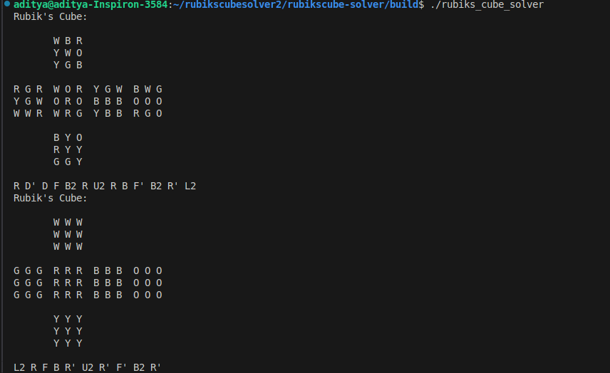

# rubikscube-solver
## Working Example

For this example, the solver uses the IDA* (Iterative Deepening A*) algorithm with a corner pattern database for efficient solving. The program automatically:
1. Takes a scrambled Rubik's cube as input
2. Processes it using the pattern database
3. Finds an optimal or near-optimal solution
4. Displays the sequence of moves to solve the cube

The output is shown below:-
